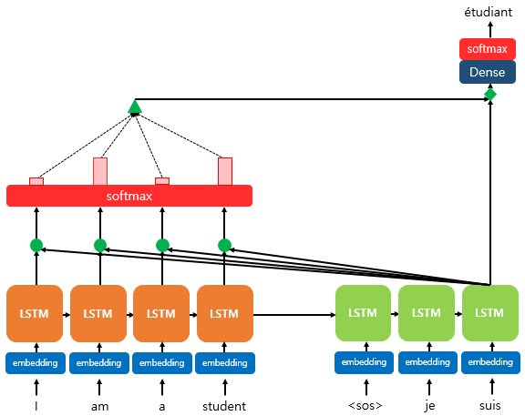

# Transformer

트랜스 포머를 보기 전에, Attention에 대한 이해도가 필요하기에 어텐션을 먼저 살펴보자.

## Attention

seq2seq모델같은 경우, 아래와 같은 단점들이 존재한다.

> 1. 하나의 고정된 크기의 벡터에 모든 정보를 압축하려다 보니 정보 손실이 발생한다.
> 2. RNN의 고질적인 문제인 기울기 소실 문제가 존재한다.

Attention의 경우, 입력 시퀀스가 길어지면 출력 시퀀스의 정확도가 떨어지는 것을 보정하는 것을 목적으로 고안되었다.

### 1. Attention의 아이디어
<hr>

디코더에서 출력 단어를 예측하는 매 시점(time step)마다 인코더에서의 전체 입력 문장을 다시 한 번 참고한다는 점이다. 단, 전체 입력 문장을 전부 다 동일한 비율로 참고하는 것이 아닌, 해당 시점에서 예측해야 할 단어와 연관이 있는 입력 단어 부분을 좀 더 집중(attention)해서 참고한다.

### 2. 어텐션 함수
<hr>

$$ Attention(Q, K, V) = Attention Value $$

어텐션 함수는 주어진 쿼리에 대해서 모든 키와의 유사도를 각각 구한다. 그리고 구해낸 이 유사도를 키와 매핑되어 있는 각각의 값에 반영한다. 그리고 유사도가 반영된 값을 모두 더해서 리턴한다. 이를 `Attention Value`라고 하자.

Q, K, V에 해당하는 Query, Key, Value의 경우 아래와 같다.

```
Q = Query : t 시점의 디코더 셀에서의 은닉 상태
K = Keys : 모든 시점의 인코더 셀의 은닉 상태들
V = Values : 모든 시점의 인코더 셀의 은닉 상태들
```

### 3. Dot Product Attention
<hr>

어텐션은 다양한 종류가 있는데, 수식적으로 이해하기 쉽게 수식을 적용한 닷-프로덕트 어텐션을 보자.



위 그림은 디코더의 세번째 LSTM 셀에서 출력 단어를 예측할 때, 어텐션 메커니즘을 사용하는 모습을 보여준다. 

소프트 맥스 함수를 통해 나온 결과값은 I, am, a, student 단어 각각이 출력 단어를 예측할 때 얼마나 도움이 되는지의 정도를 수치화한 값이다. 위 그림에서는 빨간 직사각형의 크기로 소프트맥스 함수의 결과값의 크기를 표현했다. (크기가 클수록 도움이 되는 정도의 크기도 큼)

이러한 수치화가 측정되면 이를 하나의 정보로 담아서 디코더로 전송되는데, 위 그림에서는 초록색 삼각형이 그에 해당된다. flow는 아래와 같다.

### 1) Attention Score를 구한다.


인코더의 시점을 각각 1, 2, ..., N이라고 할 때 인코더의 은닉 상태를 각각 $h_1, h_2, ... h_N$이라고 하자. 디코더의 현재 시점 t에서의 디코더의 은닉 상태를 $s_t$라고 하자. 또한, 인코더의 은닉 상태와 디코더의 은닉 상태의 차원이 같다고 가정한다.

위 그림의 경우에는 인코더의 은닉 상태와 디코더의 은닉 상태가 동일하게 4차원이다.

시점 t에서 출력 단어를 예측하기 위해서 디코더의 셀은 두 개의 입력값을 필요로 하는데, 이전 시점인 t-1의 은닉 상태와 이전 시점 t-1에 나온 출력 단어이다. 하지만 어텐션 메커니즘에서는 출력 단어 예측에 또 다른 값을 필요로 하는데 바로 Attention Value라는 새로운 값이다. t번째 단어를 예측하기 위해서 필요한 어텐션 값을 $a_t$라 하자.

Attention Score란 현재 디코더의 시점 t에서 단어를 예측하기 위해, 인코더의 모든 은닉 상태 각각이 디코더 현 시점의 은닉 상태 $s_t$와 얼마나 유사한지를 판단하는 스코어값이다.

닷-프로덕트 어텐션에서는 이 스코어 값을 구하기 위해서 $s_t$를 전치하고 각 은닉 상태와 내적을 수행한다. 즉, `모든 어텐션 스코어 값은 스칼라이다`. 예를 들어 $s_t$와 인코더의 i번째 은닉 상태의 어텐션 스코어의 계산 방법은 아래와 같다.


$score(s_t, h_i) = s_t^Th_i$

$s_t$와 인코더의 모든 은닉 상태의 어텐션 스코어의 모음값을 $e^t$라 하자.

$e^t = [s_t^Th_1, ..., s_t^Th_N]$

### 2) 소프트 맥스 함수를 통해 어텐션 분포를 구한다.


$e^t$에 소프트맥스 함수를 적용하여 나오는 확률 분포를 어텐션 분포라고 한다.

### 3) 각 인코더의 어텐션 가중치와 은닉 상태를 가중합하여 Attention Value를 구한다.


$$ a_t =  \displaystyle\sum_{i=1}^{N}{a_i^th_i}$$

이러한 어텐션 값은 종종 인코더의 문맥을 포함하고 있다고 하여, context vector라고도 불린다.

### 4) 어텐션 값과 디코더의 t 시점의 은닉 상태를 연결한다. (Concatenate)


Attention Value인 $a_t$를 구했고, $a_t$와 $s_t$를 결합하여 하나의 벡터로 만든다. 이를 $v_t$라고 한다. 그리고 이 $v_t$를 $\hat{y}$예측 연산의 입력으로 사용한다.

### 5) 출력층 연산의 입력이 되는 $\tilde{s}_t$를 계산한다.


$W_c$는 학습 가능한 가중치 행렬, $b_c$는 편향이다.

$$ \tilde{s}_t = tanh(W_c[a_t;s_t] + b_c) $$

### 6) $\tilde{s}_t$를 출력층의 입력으로 사용한다.

$$ \hat{y}_t = Softmax(W_y\tilde{s}_t + b_y) $$

### 다른 종류의 어텐션

|이름|스코어 함수|Defined by|
|:--:|:--:|:--:|
|dot|$score(s_t, h_i) = s_i^Th_i$|Luong et al.(2015)|
|scaled dot|$ score(s_t, h_i) = {s_t^Th_i\over \sqrt{n}} $|Vaswani et al.(2017)|
|general|$ score(s_t, h_i) = s_t^TW_ah_i $ 단, W_a는 학습 가능한 가중치 행렬|Luong et al. (2015)|
|concat|$ score(s_t, h_i) = W_a^Ttanh(W_b[s_t;h_i]), score(s_t, h_i) = W_a^Ttanh(W_bs_t + W_ch_i) $|Bahdanau et al.|
|location - base|$ \alpha_t = softmax(W_as_t) $ ||